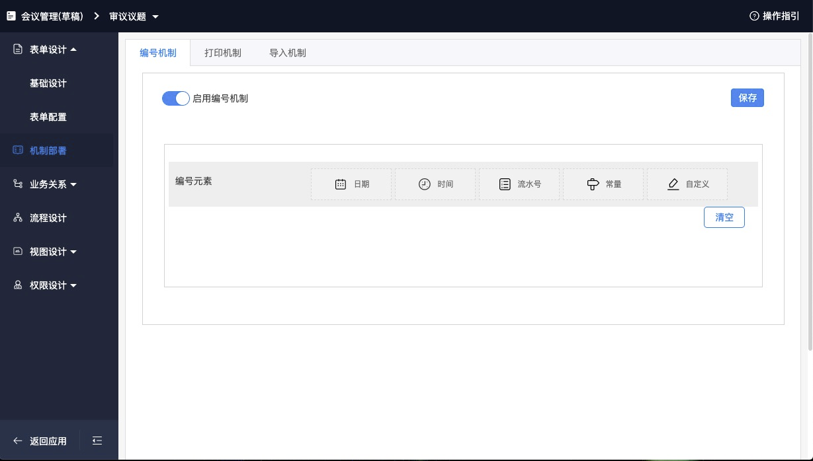
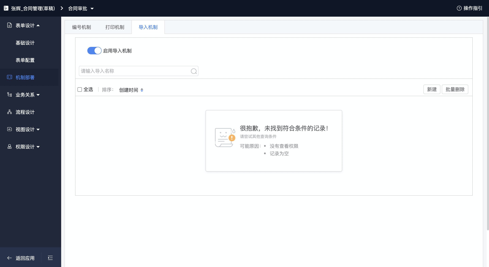
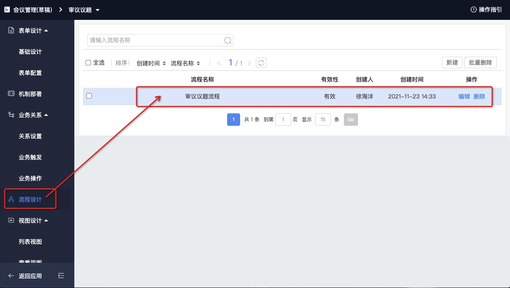
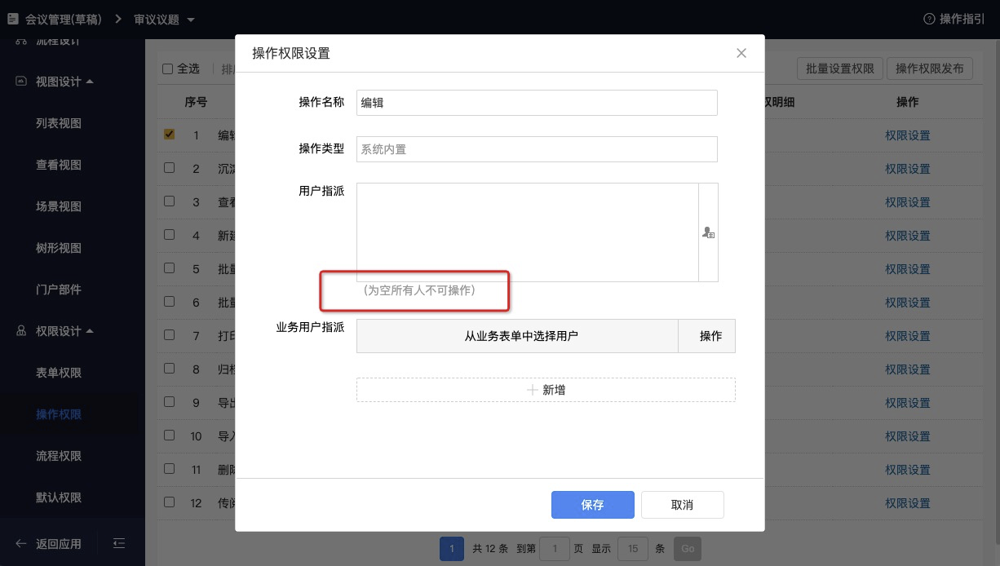
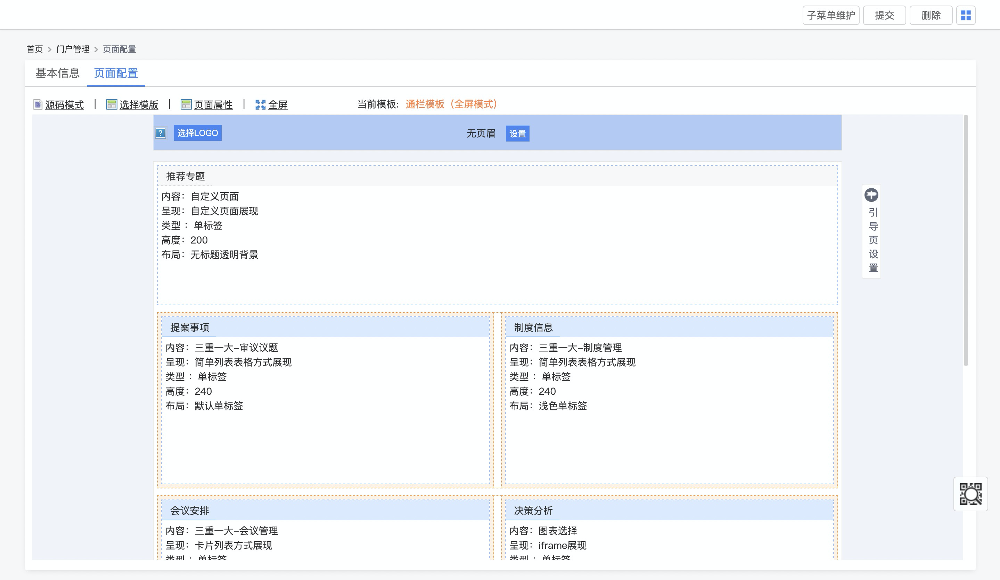

## 应用导入常见问题

应用导入之后，由于存在不同版本、不同环境的切换，会存在一些导航、视图、操作权限等与原有应用不同问题，需要应用维护人员后台修正后才可正常投入使用，应用维护人员可从以下几方面对应用内的设置进行检查：

### 1、机制部署

编号机制

现象：导入之前设置了编号机制，导入后出现无法创建文档或创建报错

原因：防止当前系统内编号冲突，编号机制必须手动设置、应用维护人员确认后，编号机制才可生效

解决办法：导入后系统只能做到启用编号机制，需要应用维护人员手动设置编号规则，保存后可正常使用

导入机制

现象：导入之前设置了表单的导入自定义模板，应用导入后无法正常导入

原因：导入的自定义模板目前无法跟随应用一起导入

解决办法：导入后系统需要应用维护人员重新设置表单导入的自定义模板，保存后可正常使用

### 2、流程设计

现象：流程节点报错、找不到审批人

原因：导入到新环境的应用，系统将只保留流程框架和触发事件，期间的具体审批人员需要重新设置

解决办法：导入前的业务流程如果有设置了审批人/组织，导入后需要重新设置审批人/组织

### 3、操作权限

现象：原系统的操作权限按钮在新导入系统上无法看到

原因：导入到新环境的应用，系统将只保留按钮的视图设置，按钮的用户指派需要重新设置，未设置则所有人不可操作

解决办法：将需要进行用户指派的操作按钮手动进行指派设置

扩展问题1：按照上面方法设置了按钮的用户指派，用户还是看不到操作按钮？

解决办法：系统发布操作权限需要一点时间，且需要用户的浏览器退出当前登录状态后重新登录才生效
 

扩展问题2：按照以上的方法设置了用户并重新登录，为什么还是看不到一些机制相关的按钮，如打印、导入？

解决办法：由于一些按钮是关联了系统的机制，需要在【应用-具体表单-机制部署】中打开对应机制的开关才可见对应的操作按钮

### 4、业务导航/表单视图

现象：原系统的业务导航/视图在新的应用系统上丢失

原因：当应用导出的环境和导入的环境版本有较大差距，如导出环境为V15环境，导入环境为最新V16环境时，由于功能未完全下沉，会出现此问题

解决办法：需要用户进行手动设置

### 5、门户管理

现象：原系统的门户内容新的应用系统上丢失

原因：应用导入的新环境门户需要手动设置、人工确认，防止导入后带入门户的设置影响用户正常使用

解决办法：需要用户进行手动设置，位置【门户引擎-门户维护-门户配置】

