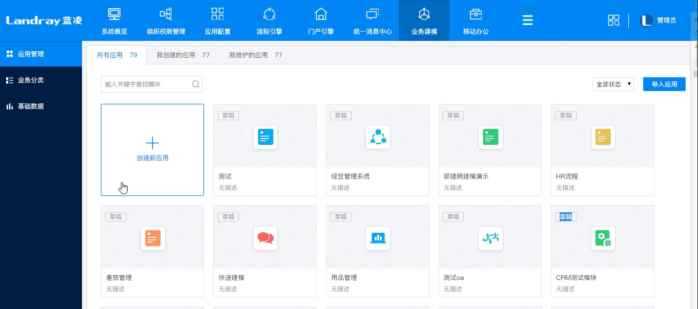
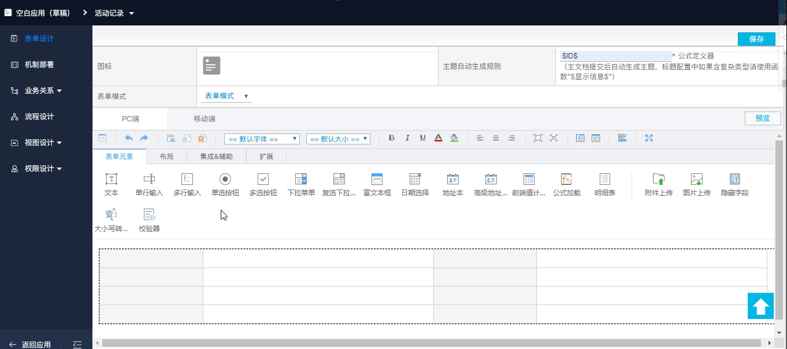
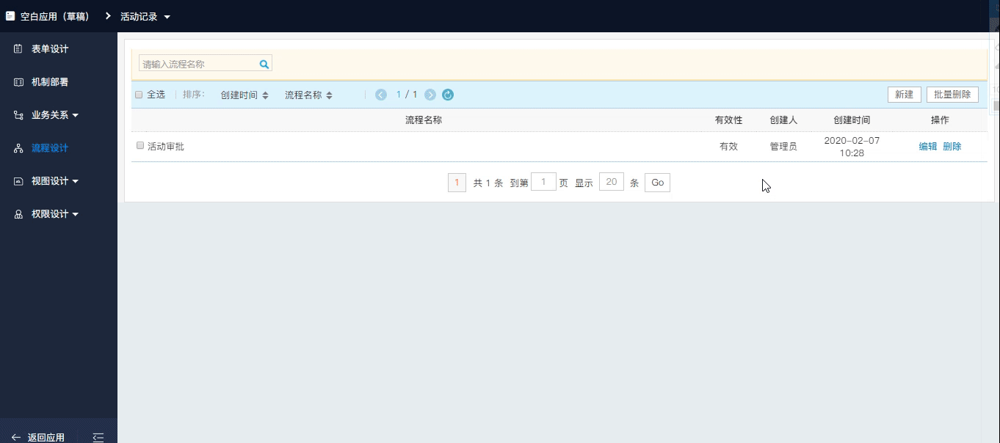
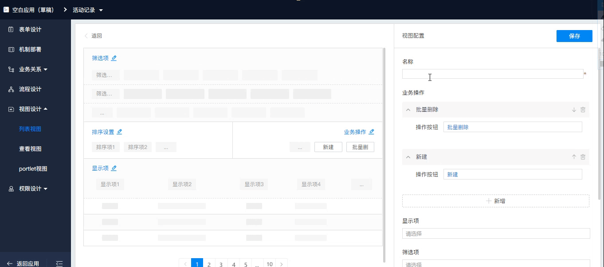
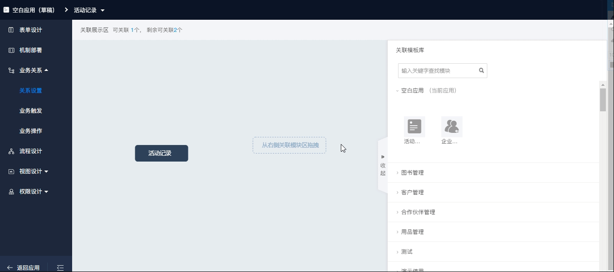
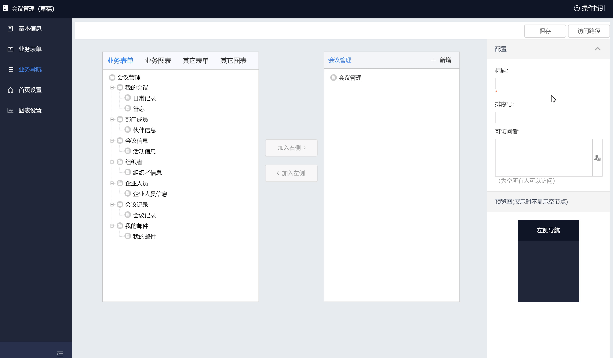

# 新手入门
如何上手低代码平台？学会以下内容，即可快速掌握低代码平台的基础功能和配置方法。

## 应用创建
通过“首页-低代码平台”，进入应用管理页面。你可以直接导入应用使用，或者自行创建一个新应用。

## 表单设计
表单按使用类型的不同分为流程表单和无流程表单。 
流程表单，是审批流程加上表单，它既具备表单填写、修改数据的功能，也具备审批流程。 
无流程表单，它仅用于存储各种管理数据，只具备表单填写、修改数据的功能。 
表单创建方式也有两种，一种是直接导入表单使用；一种是创建空白表单，根据需求自定义添加字段；

## 流程设计
当表单需要多方参与、按一定顺序提交数据时，就要用到“流程”。那么在表单配置时就选择“流程表单”来创建。 
管理员提前设置好流程的节点，审批人和数据流转的路径。一旦数据提交后，就会进入流程，按照流程的设定进行流转。

## 视图设计 
当我们配置好表单以后，如何将信息展现给前台使用的用户，就需要进行视图设计。

## 关系设置
当我们创建好表单，配置好流程和视图，做好准备工作以后，如何让表单之间形成联系，如何将表单用起来，就需要进行关系设置。

## 业务导航设置
前面我们已经配置好了表单、视图、关系，那如何让用户在前台线上页面看到我们配置的东西呢，就需要把我们想要展示的表单添加到业务导航下，展示出整个应用视图。

