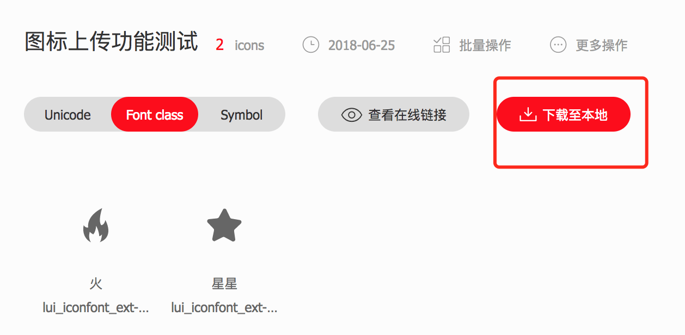

## 图标扩展帮助文档


> 图标扩展样例下载 [样例主题包下载](/ekp/sys/ui/help/font/doc/icon-ext-theme.zip)


**可能出现问题** 
> 举例说明：下文案例正常访问路径为 http://192.168.2.186:8080/oa

1. 上下文不同 `上下文`指的是端口号后面跟着的名字 ，本案例中 oa及为上下文
这种情况可以直接复制链接来下载 http://192.168.2.186:8080/oa/sys/ui/help/font/doc/icon-ext-theme.zip
2. 没有上下文 正常文档路径为：http://192.168.2.186:8080/
这种情况链接为：http://192.168.2.186:8080/sys/ui/help/font/doc/icon-ext-theme.zip

### 一、扩展快捷图标

#### step1：在主题包里添加json文件
在扩展主题包里新建一个文件夹json，在文件夹里建一个ext.json文件

**ext.json书写示例：**
```
{
	"extIcon": {
		"iconList": [
			{
				"className": "hot"
			}, {
				"className": "star"
			}
		]
	}
}
```
> 字段说明：className --需要扩展图标的类名，页面会解释成 `lui_icon_ext_hot ``lui_icon_ext_star`
####  step2： 添加css样式
icon.css中
> ps:系统给定的前缀是lui_icon_ext_ ，真实的类名是 lui_icon_ext_`className` 其中`className`是json文件中的 `className

```
.lui_icon_ext_hot{ background:url(../exticon/icon-hot.png)}
.lui_icon_ext_star{ background:url(../exticon/icon-star.png)}
```
#### step3: 上传主题包
效果会出出来一栏扩展图标如下：

ps：由于改方法是在扩展主题包内，所以只有选择 特定的主题包才会出现扩展的图标
####  step4：扩展后的效果


### 二、扩展矢量图标

#### 2.1 在主题包扩展矢量图标步骤说明

##### step1：添加json文件
> 和前面提到的扩展图标的方法是一致的，在扩展主题包里新建一个文件夹json，在文件夹里建一个ext.json文件
> 假如文件已经存在可以直接在里面写，不用新建

**ext.json书写示例：**
```
{
	"extIconFont": {
		"iconList": [
			{
				"name": "火",
				"className": "hot"
			},{
				"name": "星星",
				"className": "star"
			}
		]
	}
}
```
**字段说明**：
* name -- 选择图标弹出框的文字信息
* className -- 图标的类名
 eg： "className": "hot" -- 生成的图标类名 `lui_iconfont_ext_star` `iconfont_ext`
* 其中 `iconfont_ext` 是所有扩展图标公共的类名`lui_iconfont_ext_`是扩展图标公共的前缀
##### step2:通过阿里平台制作字体图标，
在2.2节会讲到如何制作字体图标，此处略过


##### step3:通过阿里平台制作图标下载后，拷贝5个文件放到主题包下 style内


##### step4:主题包上传
上传后的选择图标效果：

和前面提到的快捷图标扩展一样，也只有在选定了指定的主题包才能出现这些扩展的矢量图标
#### step5:扩展后的效果


#### 2.2如何通过阿里平台制作字体图标
> 本小结主要介绍如何通过阿里平台上传图标，直接生成字体文件和代码可以直接应用
>[阿里官方帮助文档](http://iconfont.cn/help/detail?spm=a313x.7781069.1998910419.14&helptype=draw)

##### step1：上传svg，编辑项目信息

项目编辑


> fontclass前缀：lui_iconfont_ext
> fontfamily:iconfont_ext

##### step2：下载代码修改iconfont.css前缀

批量替换前缀 lui_iconfont_ext-  为 lui_iconfont_ext_
##### tips：阿里平台制作图标注意事项
* 类名不能太长，超过20个字符，下载的时候会截断
* 类名前后如果有数字，生成后也会截断

### 三、风险点
tips：产品现在所有的扩展图标都是基于主题包做的，这样会存在如下风险：
1. 选择扩展主题包的时候，系统切换到指定的主题包下能能选择扩展的图标
2. 扩展的图标也只能在指定的主题下才会显示
其他的主题会出现下图所示的风险


3. 这些风险需要和客户说明


